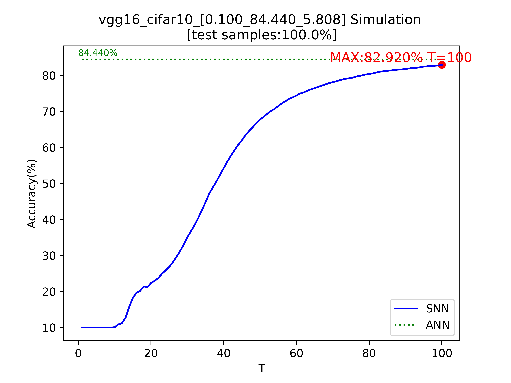
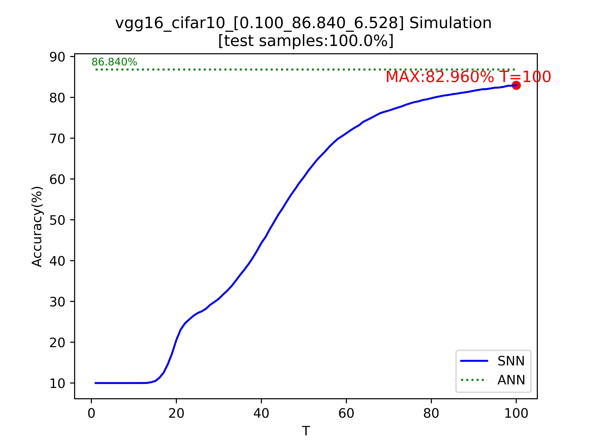
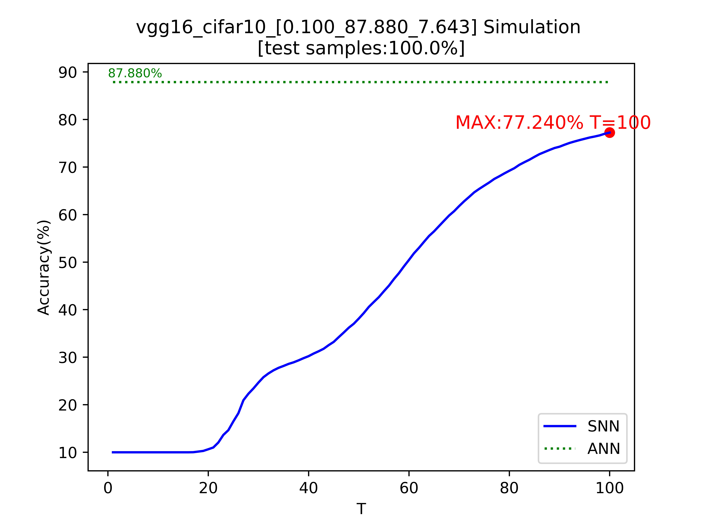

# Optimal ANN-SNN Conversion for Fast and Accurate Inferencein Deep Spiking Neural Networks
This directory contains the code of this paper.

To sum up, this paper proposes a method for training ANN, which makes ANN closer to SNN. 
The method is based on the equivalent conversion theory of ANN-SNN and establish an analysis of firing rate approximation.

We propose an optimal fit curve to quantify the fit between the activation value of source ANN and the actual firing rate of target SNN, and derive one upper bound of this convergent curve. We show that based on the Squeeze Theorem, the inference time can be reduced by optimizing the coefficient in the upper bound. These results can not only systematically explain previous findings that reasonable scaling of the threshold can speed up inference, but also give a proper theoretical basis for fast inference research.

We suggest two techniques for ANN training:

- Rate Norm Layer

- Rate Inference Loss

See ``tutorial.py`` for a fast startup. Note that the ANN accuracy actually highly dependent with the data augmentation method. 
User can use your better data augmentation method to get better accuracy as the primary goal of our work is conversion.
If you think the performance of the model is not good enough, please modify the model to train the corresponding ANN.


The first thing is to train a good model with fixed threshold scale:

```
for epoch in range(start_epoch, start_epoch + epoch):
    adjust_learning_rate(optimizer1, epoch)
    if epoch==start_epoch:
        para_train_val(epoch)
    ret = ann_train(epoch)
    if ret == False:
        break
    para_train_val(epoch)
    print("\nThres:")
    for n, m in model.named_modules():
        if isinstance(m, modules.SpikingNorm):
            print('thres', m.calc_v_th().data, 'scale', m.calc_scale().data)
```

After each epoch of training, the console will print out the thresholds for each layer of simulated neurons.
optimizer1 includes all linear layer parameters, but does not include neuron trainable scale factors. Because the first stage is only responsible for performance improvement. Once again, if you feel that the performance is not good, please set up a better data augmentation method by yourself (cutout is a good method by the way)

The second thing is to train a good scale factor. First you need to lock the maximum value of SpikeNorm and train an SNN model based on it that is within your tolerance tolerance. When the scaling factor makes the threshold smaller, the model may degrade performance, so you need to set acc_tolerance (default 0.1). This means that larger accuracy reduction will not output the model. For slower performance degradation, you may want a smaller learning rate, such as 1e-4.optimizer2 for training with scaling factors only. To better train the scaling factor, a recommended way is to set the scaling factor sharing: sharescale=True. During training, the folder will save some models with different performances. For example a model might be named ``vgg16_cifar10_[0.100_84.440_5.808].pth``. ``0.100`` means the lambda you use, the larger the lambda, the more dominant the Rate Inference loss. ``84.440`` represents the accuracy of the current model, which is the accuracy of the SNN when the time is infinite. ``5.808`` is the average omega for the current model. The definition of omega is related to the approximation theory in our article. In the saved models, you can choose the model suitable for your task based on the balance of accuracy and omega. If you don't get the model with the performance you expect, tune lambda and lr.

```
dataset = train_dataloader.dataset
train_set, val_set = torch.utils.data.random_split(dataset, [40000, 10000])

train_dataloader = DataLoader(train_set, batch_size=batch_size, shuffle=True, num_workers=0, pin_memory=True)
val_dataloader = DataLoader(val_set, batch_size=batch_size, shuffle=False, num_workers=0, pin_memory=True)

model.load_state_dict(torch.load('train_vgg16_cifar10/vgg16_cifar10.pth')['net'])

if sharescale:
    first_scale = None
    sharescale = nn.Parameter(torch.Tensor([scale_init]))
    for m in model.modules():
        if isinstance(m, modules.SpikingNorm):
            setattr(m, 'scale', sharescale)
            m.lock_max = True

divide_trainable_modules(model)

# define opt2
lr = 0.001
inspect_interval = 100
if optimizer == 'sgd':
    optimizer2 = optim.SGD(snn_train_module.parameters(),
                           momentum=momentum,
                           lr=lr,
                           weight_decay=decay)
elif optimizer == 'adam':
    optimizer2 = optim.Adam(snn_train_module.parameters(),
                           lr=lr,
                           weight_decay=decay)

best_acc = get_acc(val_dataloader)
for e in range(0, epoch):
    adjust_learning_rate(optimizer2, e)
    ret = snn_train(e)
    if ret == False:
        break
    print("\nThres:")
    for n, m in model.named_modules():
        if isinstance(m, modules.SpikingNorm):
            print('thres', m.calc_v_th().data, 'scale', m.calc_scale().data, 'scale_t',m.scale.data)
```

Finally, with SpikingJelly, you can simulate the trained model, here we show the inference results of three trained models: ``vgg16_cifar10_[0.100_84.440_5.808]``,``vgg16_cifar10_[0.100_86.840_6.528 ]``,``vgg16_cifar10_[0.100_87.880_7.643]``.
Please open dir ``train_vgg16_cifar10``.

``vgg16_cifar10_[0.100_84.440_5.808]``
<p align="center"></p>

``vgg16_cifar10_[0.100_86.840_6.528 ]``
<p align="center"></p>

``vgg16_cifar10_[0.100_87.880_7.643]``
<p align="center"></p>
